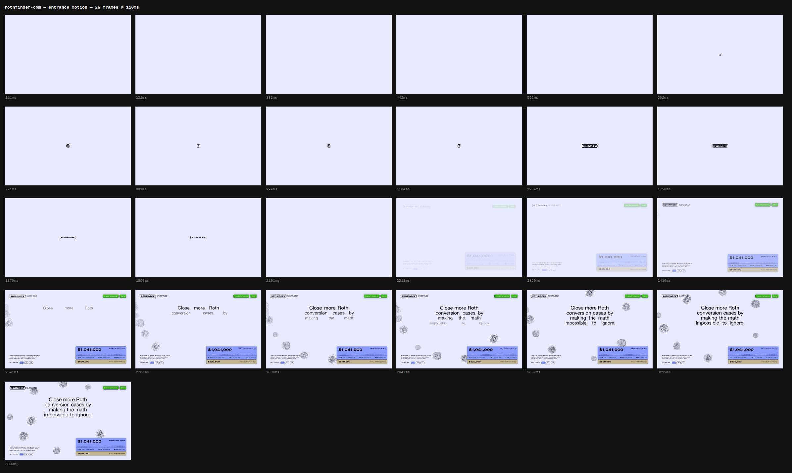
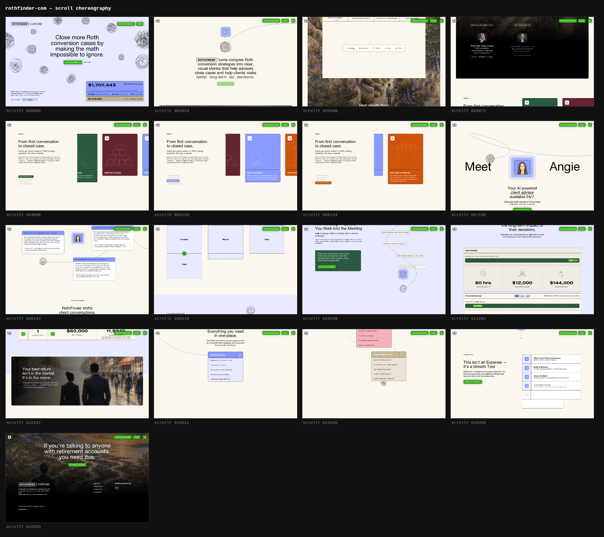

# atelier

**A method for designing a product, and a tool that measures what live sites
actually do.**

Three Claude Code skills that work together:

| | |
|---|---|
| **`atelier`** | Seven gated disciplines, from *should this exist* to *did it work* — with UX, CX, marketing and visual direction carried as lanes across them |
| **`teardown`** | Drives a real browser to read a site's entrance motion, scroll choreography, easing curves, stagger cadence, mobile composition and reduced-motion honesty |
| **`inspire`** | Turns that library into three priced, traced directions — and refuses to let one become a clone |

---

## Why `teardown` exists

A screenshot cannot show motion, and motion is most of what makes a good site
good. Ask any coding agent to "make it feel like *that site*" from an image and
you get confident nonsense about timing.

So: drive the page, capture it, and read the source of truth.

**Labelled contact sheets an agent can actually read.** 20 frames at 90ms across
the entrance, the whole page at labelled scroll positions, and the 390px
composition beside it.



*Read straight off the sheet: a flat field until 552ms · a mark grows at centre ·
it resolves into the wordmark and **holds** from 1254 to 1990ms · the screen
clears · at 2211ms the page ghosts in with the wordmark now parked top-left ·
from 2541ms the headline assembles with its **words spread wide and converging**,
line by line, until it settles at 3333ms. None of that is visible in a
screenshot — and the word-spacing collapse is not something you would guess.*



**And the numbers behind them**, because "snappy" is not buildable:

```
12 reveals, median 337ms, easing ease-out (fit error 0.025)
2 staggered groups: 142ms and 150ms — measured independently
reduced-motion blocks: 0
```

CSS durations and easings come straight off the stylesheet, so they are exact.
Sampled reveal durations are wall-clock and hold up. **Where the entrance sits
on the clock does not** — the CPU pin slows page load, so absolute positions in
the entrance sheet run long against what a user sees. The *order and proportion*
are what to read there.

A stagger that measures the same in two unrelated places is a *decision*
someone made, and you can adopt the decision without copying the page. Across
eleven sites measured this way, three unrelated builds independently landed on
**142ms, 150ms and 151ms** — and two curves,
`cubic-bezier(0.22, 1, 0.36, 1)` and `cubic-bezier(0.32, 0.72, 0, 1)`, turn up
on five sites across five different stacks.

### What it extracts

- **Entrance motion** — burst-captured before the page settles, which is the
  only way to see it at all
- **Per-element reveal curves** — start, duration, travel, and the easing
  classified against ten standard beziers *with the fit error reported*
- **Stagger cadence** — the median gap between siblings in a staged group
- **Declared CSS** — every `@keyframes`, transition, `cubic-bezier()` and
  duration, plus the site's own custom properties. Cross-origin stylesheets are
  re-fetched and re-injected so CDN-hosted CSS is not invisible
- **Stack fingerprint** — GSAP, Framer Motion, Lenis, Three, Swup, Lottie…
- **Mobile as a different composition**, not a narrower one — including what got
  dropped
- **`prefers-reduced-motion` honesty** — the fastest read on whether motion was
  designed or decorated
- **Type and colour census, CWV, metadata, JSON-LD, hover deltas**

### What it cannot see

Stated up front, because a tool that hides its blind spots is worse than no
tool:

- **Canvas and WebGL** yield frames and a fingerprint, never a rule
- **Easing names are shapes, not values** — `motion.json` names the nearest
  standard curve; `facts.json` has the literal `cubic-bezier()` when one exists
- **Performance figures are one lab run** on one machine. They rank sites
  against each other; they are not field data
- **Anything behind authentication**, or a site that blocks headless Chromium

---

## Install

### As a Claude Code plugin

```
/plugin marketplace add amir-salmani/atelier
/plugin install atelier@atelier
```

### Or clone it

```bash
git clone https://github.com/amir-salmani/atelier
cd atelier
npm install
npx playwright install chromium        # ~170MB, once
```

Then either symlink the skills into `~/.claude/skills/`:

```bash
for s in atelier teardown inspire; do
  ln -s "$PWD/skills/$s" ~/.claude/skills/$s
done
```

…or copy them. The skills read `method/` and `docs/` from
`${CLAUDE_PLUGIN_ROOT}` when installed as a plugin, or from the repo root when
cloned.

### First teardown

```bash
node tools/teardown.mjs https://example.com
```

Writes `./teardowns/_packet/<slug>/`. Set `$ATELIER_TEARDOWNS` or pass
`--out DIR` to keep your library somewhere else.

**It pins itself** to a quarter of your cores under `nice`, because Chromium
sizes its rasteriser pool to the core count — unpinned with software GL it put
an 18-core laptop at load 12. `--cores N` widens it. WebGL is opt-in behind
`--webgl` for the same reason. Run one at a time.

---

## The method

Seven gated disciplines. Nothing downstream starts until the artifact is
reviewed. [`method/index.md`](method/index.md) is the map.

**0 · The wedge** — should this exist? Exit is a falsifiable thesis *with a kill
condition*. **1 · Journeys** — a story about a named person, drawing only from
pain that actually happened. **2 · Domain model.** **3 · Architecture and
stack** — decided *here*, after the requirements are known, never first.
**4 · Sequencing** — depth-first on one flow. **5 · Spec → plan → code** —
[the gate](method/the-gate.md). **6 · Contact and aftercare** — answers
discipline 0 with numbers.

Across all of them, [**two lanes**](method/lanes.md):

- **The experience surface.** CX and marketing are columns on journeys that
  already exist, not stages you reach. The lane's whole justification is the
  *unowned* touchpoint — the provider-default receipt, the password reset, the
  invoice PDF, the cancellation mail, the status page during an incident. Those
  define the product to a customer having a bad day, and nobody designs them
  because they are not on a screen anyone is building.
- **Surface craft.** The direction brief is produced at disciplines 1–2 and
  honoured at 5 — so the look is not invented under deadline from whatever
  reference was open that week.

---

## Taking mechanism without taking dressing

A library of teardowns makes copying easy. That is the entire risk of building
one, so [`method/originality.md`](method/originality.md) is a gate, not a note.

Everything you admire splits into three parts:

| | |
|---|---|
| **Mechanism** | *"The accent word arrives alone, ~200ms before its own sentence"* |
| **Dressing** | The typeface, the colour, that word, that position |
| **Reason** | *Their headline turns on a single verb* |

**Mechanism may be taken. Dressing never. And mechanism only transfers if the
reason survives the swap** — applied to a headline with no load-bearing word,
that same trick is just a word flashing on a dark screen.

Four tests, each able to fail:

1. **Swap test.** Put your content in their design. *If it still looks right,
   you copied.* Apply their mechanism to your content; if the result looks
   nothing like their page, you learned.
2. **Three-source rule.** Every element traces to ≥2 unrelated teardowns, *or*
   one constraint of your own product. One source is a lift.
3. **Inversion.** Name the opposite and why you rejected it. "It feels better"
   means you defaulted — and a borrowed default is a clone with extra steps.
4. **Subtraction.** Remove the most distinctive element. If it still works, that
   element was decoration.

`inspire` enforces this structurally: **three directions, one of them
mandatorily quiet** (no new mechanism — three novel options is a rigged
ballot), each committing to tempo, easing and stagger as *numbers*, with a
provenance table where **failed rows stay in**. A table with no rejections was
not audited.

---

## Layout

```
skills/{atelier,teardown,inspire}/SKILL.md
method/          the seven disciplines, the gate, the lanes, inspire, originality
tools/           the teardown runner
docs/            running a teardown, and reading one without fooling yourself
examples/        one worked teardown, showing the standard of evidence
```

## Courtesy

Tear down sites you are allowed to load, one at a time, and never point it at
anything behind someone else's authentication. A teardown is a technique study,
not a review — and every number in one is true of a single capture on a single
date.

## Licence

MIT. See [`CONTRIBUTING.md`](CONTRIBUTING.md) if you want to add to it.
